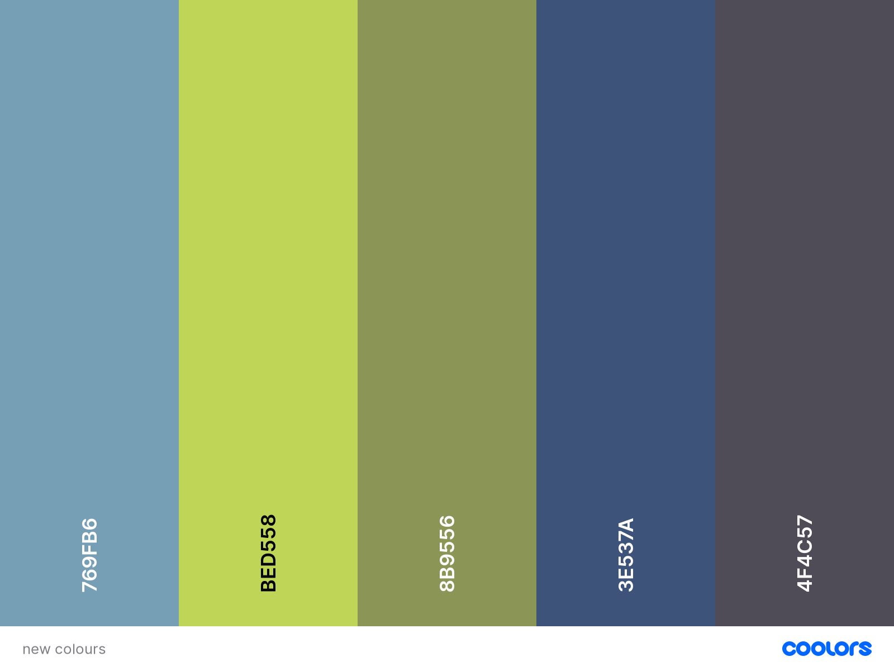

# Science-Quiz

## **Goal for this project**

Welcome to Science Quiz!

This website was created to entertain and educate the visitor about science. A fun quiz with varying topics of science such as chemistry, biology, earth science and physics, all wrapped into a natural and clear design.

This quiz contains 3 difficulty levels to chose from with 10 questions each. With every question 4 answers presented to chose the correct one from. Feedback of the overall score achieved by the user is presented in the end of the quiz.

The website has a user-friendly layout and provides easy access to all necessary information.

Thank you for visiting!

Should you have any questions regarding my project feel free to reach out to me via the provided GitHub contact details.

## Table of contents 
- [Science-Quiz](#science-quiz)
  - [**Goal for this project**](#goal-for-this-project)
  - [Table of contents](#table-of-contents)
  - [**UX**](#ux)
    - [User Goals](#user-goals)
    - [User Stories](#user-stories)
    - [Site Owner's Goals](#site-owners-goals)
    - [Design Choices](#design-choices)
    - [Colours](#colours)
    - [Structure](#structure)
    - [Logo](#logo)
    - [Background](#background)
    - [Fonts](#fonts)
    - [Icons](#icons)
  - [**Wireframes**](#wireframes)
    - [Desktop Wireframe](#desktop-wireframe)
    - [Tablet Wireframe](#tablet-wireframe)
    - [Mobile Wireframe](#mobile-wireframe)
    - [Modal Wireframe](#modal-wireframe)
  - [**Features**](#features)
    - [Main Page Section](#main-page-section)
    - [Modal Section](#modal-section)
  - [**Technologies used**](#technologies-used)
    - [**Languages**](#languages)
    - [**Tools**](#tools)
  - [**Testing**](#testing)
    - [Home Button](#home-button)
  - [**Deployment**](#deployment)

## **UX**

### User Goals

* A quiz game website containing valuable information about science
* Website accessible and easy to use on desktop, tablet & mobile
* Appealing, natural and simple design
* Providing educational value through an enjoyable quiz game
* Direct links to social media sites

[Back to Top](#table-of-contents)

### User Stories

* As a user, I want to be able to test my knowledge about science.
* As a user, I want to receive a feedback of my achieved score.
* As a user, I want an appealing design.
* As a user, I want text and images to appear clear and visible.
* As a user, I want the website to have an easy to navigate design.
* As a user, I want the website to be fully suitable for use on mobile phones and tablets as well as on desktop computers.
* As a user, I want to be able to access relevant social media links from the website, and expect these to open on separate tabs.

[Back to Top](#table-of-contents)

### Site Owner's Goals

* Providing information about science. 
* Providing an interactive and enjoyable quiz to educate about science.
* Providing feedback of the achieved score.

### Design Choices

The website is a quiz game to test people's knowledge of science, therefore design choices are clear and natural.

### Colours

The design was created using natural colours such as shades of green (#BED558, #8B9556) and blue (#769FB6, #3E537A) with gray (#4F4C57) to create shadow and pattern.

### Structure

The website's structure is created with the use of [Bootstrap](https://getbootstrap.com/) to ensure compatibility across various devices.

### Logo

The logo is created via [Looka](https://looka.com/). 

### Background

The background image is created via [Patternico] (https://patternico.com).

### Fonts

Fonts are customised via [Google Fonts](https://fonts.google.com)

### Icons

Fav icons are created via [Favicon.io](https://favicon.io/favicon-generator/) 

## **Wireframes**

The website's wireframes were created via [Balsamiq](https://balsamiq.com/wireframes/).

Wireframes are available on the links below:

### [Desktop Wireframe](wireframes/desktop-wireframe.png)

### [Tablet Wireframe](wireframes/tablet-wireframe.png)

### [Mobile Wireframe](wireframes/mobile-wireframe.png)

### [Modal Wireframe](wireframes/modal-wireframe.png)

[Back to Top](#table-of-contents)

## **Features** 

### Main Page Section

The Main Page contains the interactive quiz with 10 science questions and 4 answer options. The question counter of the main page helps the user to track their progress in the quiz. There are links present in the footer to relevant social media sites. A home button is implemented on the left-top corner allows user to easily return to the first question of the quiz on the main page.

### Modal Section

The modal pops up in the end of the quiz presenting the result in percentages offering the option of playing again or exit.

## **Technologies used**
### **Languages**

* [HTML](https://en.wikipedia.org/wiki/HTML)
* [CSS](https://en.wikipedia.org/wiki/Cascading_Style_Sheets)
* [JavaScript](https://en.wikipedia.org/wiki/JavaScript)

[Back to Top](#table-of-contents)

### **Tools**
* [GitHub](https://github.com/)
* [W3C HTML Validation Service](https://validator.w3.org/)
* [W3C CSS Validation Service](https://jigsaw.w3.org/css-validator/)
* [Tiny PNG](https://tinypng.com/)

[Back to Top](#table-of-contents)

## **Testing**

The W3C Markup Validator and the W3C CSS Validator were used to validate the html and css files in the project and to ensure there were no syntax errors and JS Hint was used to check the javascript file.

* **W3C Markup Validator**
index.html - TBC

* **W3C CSS Validator**
style.css - No error found.

* **JS Hint** 
quiz.js - TBC

**Testing User Stories**

* As a user, I want to be able to test my knowledge about science.

Users are provided 10 questions each on 3 difficulty levels to test their knowledge with a feedback of the achieved score.

* As a user, I want an appealing design.

The design is simple, natural, easy to navigate and the text is clearly visible. 

* As a user, I want the website to be fully suitable for use on mobile phones and tablets as well as on desktop computers.

The website has a responsive design across multiple devices (mobile, tablet and desktop).

* As a user, I want to be able to access relevant social media links from the website, and expect these to open on separate tabs.

Relevant social media icons are present in footer, both are opening in new tabs.

### Home Button

* **Plan**    
Include a fixed home button on the left-top of the screen to allow users to easily navigate back to the first page of the quiz.

## **Deployment**

This project was deployed via GitHub by executing following the steps below.

1. Commit and push code to GitHub.
2. Navigate to the repository on github and click on **Settings**.
3. Go to **Source section** within the Github Pages section.
4. Select **master branch** on the dropdown menu, and click save.
5. Now the website is live on **https://doriczele.github.io/Angelika-s-Wedding-Cakes/**
6. Any time commits and pushes are sent to Github, the Github Pages site should update shortly after.

To run the project locally:

1. Click the **green Clone or Download button** on the Github Repository
1. Using the **Clone with HTTPS option**, copy the link displayed.
1. Open your IDE, and ensure the Git Terminal is open.
1. Change the working directory to the location where the cloned directory is to go.
1. Use the **"git clone" command** and paste the url copied in the second step.

[Back to Top](#table-of-contents)
